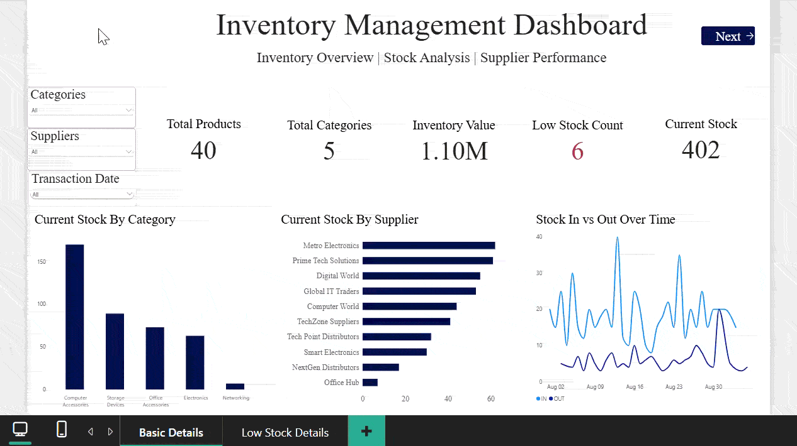

Inventory Management System
********* ********** ******
Project Overview
******* ********
The Inventory Management System is a data analytics project designed to monitor and analyze inventory data for an electronics store.

The project uses Supabase PostgreSQL as the database and Power BI for data modeling, analysis, and interactive dashboard visualization.

The dashboard helps users understand stock levels, stock movement, low-stock products, suppliers, categories, and inventory shortages.
**********
Objectives
**********
Monitor current inventory levels

Identify low-stock products

Analyze stock-in and stock-out transactions

Track inventory by category and supplier

Identify product shortages

Analyze supplier and category performance

Create an interactive Power BI dashboard
************ ****
Technologies Used
************ ****
Supabase PostgreSQL – Database management

SQL – Data querying and analysis

Power BI – Data visualization and dashboard

DAX – Measures and calculations

Google Sheets – Initial data preparation

GitHub – Project documentation and version control
******** *********
Database Structure
******** *********
The project contains the following main tables:

i) Categories

Stores product category information:

category_id

category_name

ii) Products

Stores product and inventory information:

product_id

product_name

category_id

supplier_id

reorder_level

stock_quantity

stock_status

created_date

iii) Suppliers

Stores supplier information:

supplier_id

supplier_name

iv) Stock Transactions

Stores inventory movement information:

transaction_id

product_id

transaction_type

quantity

transaction_date

remarks
**** ****
Data Flow
**** ****
Google Sheets → Supabase PostgreSQL → SQL Analysis → Power BI Data Modeling → DAX Measures → Interactive Dashboard
***** ** *********
Power BI Dashboard
***** ** *********
Page 1 – Inventory Overview:

*** *********** ***********
Key Performance Indicators:
*** *********** ***********
Total Products

Total Categories

Inventory Value

Low Stock Count

Current Stock
***************
Visualizations:
***************
Current Stock by Category

Current Stock by Supplier

Stock In vs Stock Out Over Time

Category filter

Supplier filter

Transaction Date filter

Page 2 – Low Stock Details:

*** ********
Key Metrics:
*** ********
Low Stock Count

Total Reorder Value

Total Suppliers

Categories Affected
***************
Visualizations:
***************
Low Stock Product Details

Shortage by Category

Stock Status

Current Stock

Reorder Level

Shortage

A Back to Overview button is included for easy navigation between dashboard pages.
********* *** ********
Important DAX Measures
********* *** ********
Total Stock In

Total Stock In =
CALCULATE(
    SUM('public stock_transactions'[quantity]),
    'public stock_transactions'[transaction_type] = "IN"
)

Total Stock Out

Total Stock Out =
CALCULATE(
    SUM('public stock_transactions'[quantity]),
    'public stock_transactions'[transaction_type] = "OUT"
)

Current Stock

Current Stock =
[Total Stock In] - [Total Stock Out]

Total Shortage

Total Shortage =
SUMX(
    FILTER(
        'public products',
        'public products'[Stock Status] = "Low Stock"
    ),
    MAX(
        0,
        'public products'[reorder_level]
            - 'public products'[stock_quantity]
    )
)
*** ********
Key Features
*** *********
Interactive Power BI dashboard

Data cleaning and validation

PostgreSQL database management

SQL-based inventory analysis

DAX-based calculations

Low-stock identification

Inventory shortage analysis

Category-wise stock analysis

Supplier-wise stock analysis

Interactive slicers

Drill-through analysis

Dashboard page navigation
******** ********
Business Insights
******** ********
The dashboard can help an inventory team:

Identify products that need replenishment

Monitor stock movement

Track inventory shortages

Understand category-wise inventory

Monitor supplier-related inventory information

Support inventory planning and decision-making
******* *********
Project Structure
******* *********
Inventory-Management-System/
├── README.md
├── power-bi/
│   └── Inventory_Management_Dashboard.pbix
├── sql/
│   └── inventory_queries.sql
├── data/
│   ├── categories.csv
│   ├── products.csv
│   ├── suppliers.csv
│   └── stock_transactions.csv
└── screenshots/
    ├── dashboard-overview.png
    └── low-stock-details.png
*** ** ***
How to Use
*** ** ***
Create the required tables in a Supabase PostgreSQL project and load the inventory data.

Run the SQL queries provided in the SQL folder.

Connect Power BI to the Supabase PostgreSQL database.

Import the required tables and create the relationships.

Open the .pbix file in Power BI Desktop to explore the dashboard.
**** *****
Data Model
**** *****
Categories → Products → Stock Transactions
Suppliers  → Products

Security

Sensitive database credentials should not be uploaded to GitHub.

Do not upload:

Supabase database passwords

Supabase service role keys

Secret API keys

Private connection strings

Personal credentials

Future Enhancements

Automated inventory alerts

Inventory forecasting

Supplier performance analysis

Demand prediction

AI-powered inventory recommendations

Automated data refresh
****** *****
Project Type
******* ****
Data Analytics / Inventory Management Project

## Dashboard Demo

This project demonstrates practical skills in:

SQL | PostgreSQL | Supabase | Power BI | DAX | Data Modeling | Data Cleaning | Data Visualization | Business Analytics

Author

Aiswarya M

Data Analytics Project
